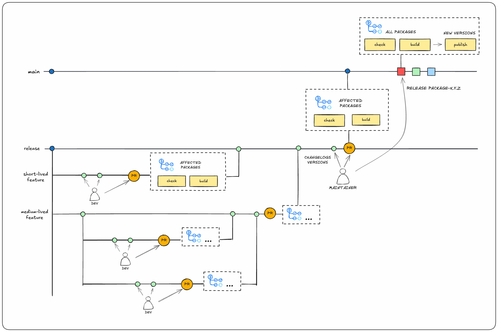

# How to contribute

Thank you for being part of the Telefónica Innovación Digital Open Source Community!

# Table of Contents

- [Getting started](#getting-started)
- [Component tasks](#component-tasks)
- [Branching model](#branching-model)
- [Pull Request](#pull-request)
- [Release process](#release-process)
   - [Versioning](#versioning)
   - [Publishing](#publishing)
- [License](#license)
  - [Licensing of new files](#licensing-of-new-files)
  - [Public Domain](#public-domain)
- [Code of Conduct](#code-of-conduct)
- [Contributor License Agreement](#contributor-license-agreement)

# Getting started

This repository is a [Pnpm]https://pnpm.io/es/ and [Nx](https://nx.dev/react)  monorepo that contains multiple components. Each component is a separate package that can be built, tested, and linted independently.

Every component has to be created in the `components` folder. Each one must contain its own package.json file, and it can have its own dependencies. Common dependencies for development and testing should be added to the root package.json file.

## Installation

To get started, clone the repository and install the dependencies:

> [!WARNING]
> Some repository components may depend on packages published in the xcut npm registry. Please login to the registry before installing the dependencies following the instructions in the [Cross NPM Confluence page](https://confluence.tid.es/display/CTO/%5BCross%5D+NPM+Packages).

```bash
pnpm install
```

# Component tasks

Component task names are standardized across the repository. This enables to define common dependencies and files impacting them in the root `nx.json` file. The following are the most common tasks:

* `lint`: Lints the component.
* `check:types`: Checks the TypeScript types in the component.
* `check:spell`: Checks the spelling in the component.
* `build`: Builds the component.
* `test:unit`: Runs the unit tests.
* `test:component`: Runs the component tests.
* `check:all`: Run all the checks and build the component.

You can also rewrite the tasks to fit the component's needs. For example, if a component has special requirements for unit tests, you can define a `test:unit` task in the component's `project.json` file, redefining the Nx inputs, outputs, and dependencies in order to fit the component's needs and optimize the cache accordingly. _(See how the `markdown-confluence-sync` component does this for an example)_

> [!WARNING]
> It is crucial to configure properly the tasks dependencies, input, and output files, so __Nx can keep or clean the cache correctly, avoiding running unnecessary tasks__, both locally or in the pipeline.

## Running tasks in components

Nx provides a way to run commands in a specific component, taking care of the task dependencies. To run a command in a component, use the following syntax: `pnpm nx run <task> <component>`. For example, to run the unit tests in the `child-process-manager` component, use the following command:

```bash
pnpm nx test:unit child-process-manager
```

> ![TIP]
> Using Nx also has the advantage of being able to cache the results of tasks, so if you run the same command again, it will be faster if any file impacting the task has not changed.

## Running a task in all components

To run a task in all components, use the following syntax: `pnpm nx run-many <task> --all`. For example, to run the unit tests in all components, use the following command:

```bash
pnpm nx run-many test:unit --all
```

This will run the `test:unit` task in all components and also the corresponding dependencies, in the right order, so everything is built and tested correctly.

# Branching model

Here you have an schema of the branching model used in this repository:

[](../docs/branching-model.png)

Some important points to consider:

* __The "main" branch must always reflect the latest stable published version of the packages in the repository__.
* We have a "release" branch for the following reasons:
   * To enable the maintainer to prepare the release of features without having to promote any unpublished changes to the "main" branch. By preparing the release we mainly mean to decide how to group changes in different releases and to update the `CHANGELOG.md` files and the version numbers of the packages accordingly.
   * It is long-lived because we also have bots that will open PRs. So, they can be configured to open PRs to the "release" branch, and their changes will also enter in the process of preparing the release, such as changes from any other contributor.
* __The "release" branch is the default branch for PRs.__ Only a project maintainer should open a PR to the "main" branch, and only when the release is ready to be published.
* Usually, feature branches should be short-lived, and they should be merged into the "release" branch as soon as possible. This way, the changes will be included in the next release, and the feature branch can be deleted.
* When necessary, a medium-lived branch can be created from the "release" branch to group changes that will be released together and require more time to be prepared. Once the changes are ready, the branch can be merged into the "release" branch.
* For publishing beta versions or fix versions of precedent releases, medium-lived branches should be also created from the "release" branch, and the publish workflow should be modified accordingly to add the `--tag` option to the `pnpm publish` command. In this case, the maintainer should tag the releases directly in the branch without merging it into the "release" branch. When the code is ready to be published as a stable release, a PR should be opened to the "release" branch, and the branch should be deleted after the PR is merged.

## Merging strategy

We use the __squash and merge strategy for merging PRs to the release branch__. This means that all the changes in the PR will be squashed into a single commit before being merged. The reasons are:

* To keep the history clean in the release branch
* To make easier to understand the changes in each release.

But we use the __merge commit strategy for merging PRs to the main branch from the release branch__. The reasons are:

* To keep in the history the information about the features that were merged separately into the release branch. This is very important, because we may have changes from different packages in the release branch. Squashing all the changes into a single commit would make it difficult to understand or revert the changes for a specific package.
* To avoid having to rebase the release branch every time a PR is merged to the main branch.

# Pull Request

When you're finished with the changes, please ensure the following:

* You have added tests for your changes.
* You have updated the documentation if necessary.
* You have run the linter and fixed any issues.
* __You have added the necessary changes to the `CHANGELOG.md` file__, under the "unreleased" section at the beginning of the file.
* You have modified the version of the package in the `package.json` file according to the [versioning](#versioning) section.

When you have checked these points, then you are ready to submit your pull request. To do so, follow these steps:

* __The target branch for the PR should be `release`.__ (Read [branching-model](#branching-model) for more information)
* Fill the PR template. This template helps reviewers understand your changes as well as the purpose of your pull request.
* Don't forget to [link PR to issue](https://docs.github.com/en/issues/tracking-your-work-with-issues/using-issues/linking-a-pull-request-to-an-issue) if you are solving one.
* Enable the checkbox to [allow maintainer edits](https://docs.github.com/en/pull-requests/collaborating-with-pull-requests/working-with-forks/allowing-changes-to-a-pull-request-branch-created-from-a-fork) so the branch can be updated for a merge. Once you submit your PR, a maintainer will review your proposal. We may ask questions or request additional information.
* We may ask for changes to be made before a PR can be merged, either using suggested changes or pull request comments. You can apply suggested changes directly through the UI. You can make any other changes in your fork, then commit them to your branch.
* As you update your PR and apply changes, mark each conversation as resolved.
* If you run into any merge issues, checkout this git tutorial to help you resolve merge conflicts and other issues.

# Release process

## Versioning

First of all, you should know that the repository follows the [Semantic Versioning](https://semver.org/) specification. This means that the version number is composed of three parts: `MAJOR.MINOR.PATCH`. __Each package in the repository has its own version number, and it is independent of the others.__ (Except for the dependencies between them, of course)
 
Please, follow these rules to update the version number:

* __MAJOR__: When you make incompatible API changes.
* __MINOR__: When you add functionality in a backwards-compatible manner.
* __PATCH__: When:
   * You make backwards-compatible bug fixes.
   * You bump the version of a dependency which doesn't affect the API of the package. __This includes internal dependencies.__

> ![WARNING]
> Remember to modify the version of the packages affected by the change in another package. For example, if you modify a package that is used by another one, you should update the version of the dependent package.
  You can use the `pnpm nx graph` command to see the dependencies between the packages. In the future we will try to implement a workflow check to ensure that versions are updated correctly, but for the moment you should do it manually.

## Publishing

Once the PR is approved and merged into the release branch, a project maintainer can start the release process when corresponding (sometimes it is not desired to release the changes immediately, so the maintainer can wait until more changes are merged to release them all together).

The release process is as follows:

* Checkout the `release` branch, and:
   * Move changes in the "unreleased" section of the `CHANGELOG.md` files to a new version section that includes the version number and the release date.
   * Check that every affected package has the correct version number in the `package.json` file.
   * Commit the changes with the message `chore(release): description`.
* Open a PR from the `release` branch to the `main` branch.
   * Once the PR is approved and merged, the build pipeline will run in the `main` branch, but packages will not be published yet.
   * Create a new release in GitHub for each package modified in the release, following the next instructions:
      * Tag: `package-name-vX.Y.Z` (Replace `package-name` with the name of the package and `X.Y.Z` with the version number, of course).
      * Title: `package-name - Human readable title for the release`.
      * Description: Copy the changes from the corresponding `CHANGELOG.md` file for the version you are releasing.
   * Once the release is created, the packages will be published to the npm registry automatically. __For the moment, creating any release will trigger the publication of all the packages__. If you have to release more than one package there is no problem, next executions will do nothing if the package is already published.
      NOTE: Publishing all packages when the first release is created has been done to avoid having packages without dependencies published due to possible errors when creating releases for each package manually. In the future, we could only release the target package based on the release tag, but some extra checks should be implemented in order to ensure that the dependencies are published before the dependent packages.

> [!WARNING]
> Some special cases may require a different process in order to avoid those versions being tagged as "latest" in the npm registry, such as publishing beta versions, or publishing fix versions of precedent releases. In such case, the release tag should be created on a branch different from "main". Read the [branching model section](#branching-model) for more information.

# License

By contributing to this project, you agree that your contributions will be licensed under the [LICENSE](../LICENSE) file in the root of this repository, and that you agree to the [Contributor License Agreement](#contributor-license-agreement).

## Licensing of new files

This project adheres to the [Software Package Data Exchange (SPDX)](https://spdx.dev/). SPDX is a standard format for communicating the components, licenses, and copyrights associated with software packages. It is a simple and concise way to communicate licensing information. Read more about how to define headers using the SPDX ids [here](https://spdx.dev/learn/handling-license-info/).

This license must be used for all new code, unless the containing project, module or externally-imported codebase uses a different license. If you can't put a header in the file due to its structure, please put it in a LICENSE file in the same directory.

```
// SPDX-FileCopyrightText: {{ year }} Telefónica Innovación Digital and contributors. All rights reserved
// SPDX-License-Identifier: Apache-2.0

# SPDX-FileCopyrightText: {{ year }} Telefónica Innovación Digital and contributors. All rights reserved
# SPDX-License-Identifier: Apache-2.0

<!--
   SPDX-FileCopyrightText: {{ year }} Telefónica Innovación Digital and contributors. All rights reserved
   SPDX-License-Identifier: Apache-2.0
-->

SPDX-FileCopyrightText: {{ year }} Telefónica Innovación Digital and contributors. All rights reserved
SPDX-License-Identifier: Apache-2.0
```

> ![TIP]
> When modifying  an existing file, you should not change the license year. Instead, please add " - {{ year }}" to the existing year. For example, if the existing license is `2019` and you are doing the change at 2024, you should change it to `2019 - 2024`.

## MIT License

This license can be used for test scripts and other short code snippets, at the discretion of the author.

```
// SPDX-FileCopyrightText: {{ year }} Telefónica Innovación Digital and contributors
// SPDX-License-Identifier: MIT

# SPDX-FileCopyrightText: {{ year }} Telefónica Innovación Digital and contributors
# SPDX-License-Identifier: MIT

<!--
   SPDX-FileCopyrightText: {{ year }} Telefónica Innovación Digital and contributors
   SPDX-License-Identifier: MIT
-->

SPDX-FileCopyrightText: {{ year }} Telefónica Innovación Digital and contributors
SPDX-License-Identifier: MIT
```

# Code of Conduct

Please read our [Code of Conduct](../.github/CODE_OF_CONDUCT.md) before contributing.

# Contributor License Agreement

This is a human-readable summary of (and not a substitute for) the [full agreement](./CLA.md). This highlights only some of the key terms of the CLA. It has no legal value and you should carefully review all the terms of the [actual CLA before agreeing](./CLA.md).

* __Grant of copyright license__. You give Telefónica Innovación Digital permission to use your copyrighted work in commercial products.
* __Grant of patent license__. If your contributed work uses a patent, you give Telefónica Innovación Digital a license to use that patent including within commercial products. You also agree that you have permission to grant this license.
* __No Warranty or Support Obligations__. By making a contribution, you are not obligating yourself to provide support for the contribution, and you are not taking on any warranty obligations or providing any assurances about how it will perform.

The [CLA](./CLA.md) does not change the terms of the underlying license used by our software such as the Business Source License, Mozilla Public License, or MIT License. You are still free to use our projects within your own projects or businesses, republish modified source code, and more subject to the terms of the project license. Please reference the appropriate license for the project you're contributing to to learn more.
